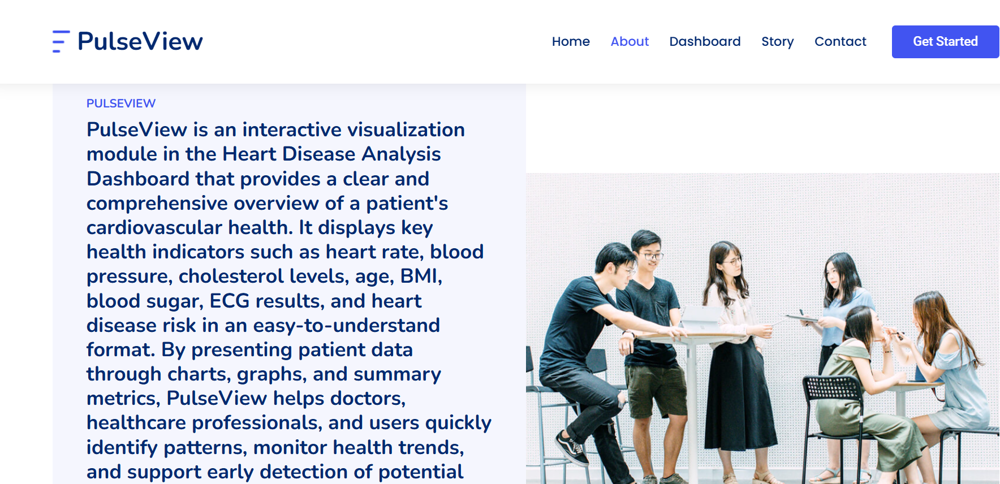
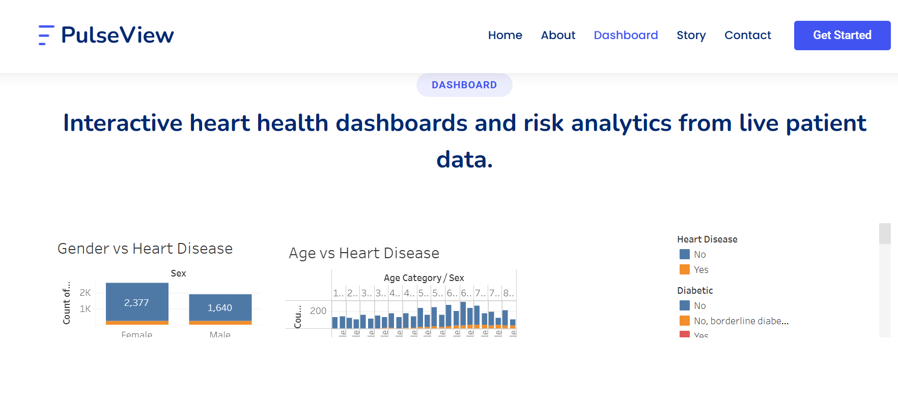
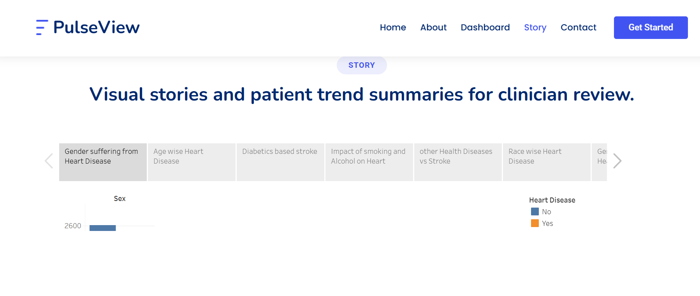
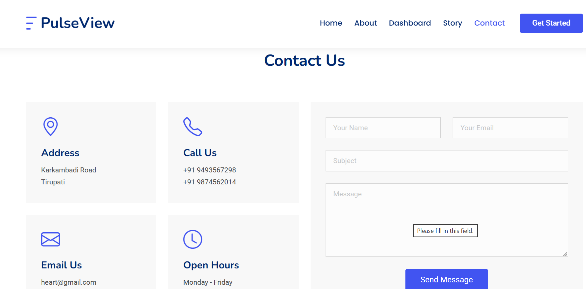

# PulseView — Heart Disease Risk Analysis Dashboard

Turning heart disease data into a heartbeat you can read.

PulseView is a Flask front end that embeds a Tableau dashboard and a four-scene guided data story, giving clinicians, policymakers, and individuals a browser-based way to explore heart-disease risk factors — no Tableau license or install required.

---

## Screenshots

**About**


**Dashboard**


**Story**


**Contact**


---

## Features

- **Home** — landing page introducing the project, with links into the story and dashboard.
- **About** — the problem statement, three user personas (cardiologist, policy officer, patient), and the six-step build process.
- **Dashboard** — the full Tableau dashboard embedded live, with four supporting panels:
  - Gender vs Heart Disease
  - Diabetic vs Stroke
  - Race-wise Heart Disease
  - Smoking and Alcohol Impact
- **Story** — a four-scene guided narrative (Overview → Gender Risk → Lifestyle Factors → Race & Conditions) with tab navigation, previous/next controls, and left/right arrow-key support.
- **Contact** — a validated contact form with flash-message feedback on submit.

## Tech Stack

| Layer | Technology |
|---|---|
| Visualization | Tableau Desktop, Tableau Public |
| Backend | Python 3, Flask 3.1.3 |
| Frontend | Css, JavaScript |
| Environment | Python `venv` |

## Project Structure

```
## 📂 Project Structure

```text
AI-Digital-Twin/
│
├── app.py                      # Flask application entry point
│
├── templates/
│   └── index.html              # Main web page
│
├── js/
│   ├── main.js                 # Frontend JavaScript
│   ├── img/                    # Images, icons, and assets
│   └── scss/                   # SCSS/CSS stylesheets
│
├── Screenshots/
│   ├── Dashboard.png           # Dashboard preview
│   ├── HomePage.png            # Landing page
│   ├── Story.png               # Story/Timeline page
│   └── contact.png             # Contact page
│
├── __pycache__/                # Python cache files (auto-generated)
│
└── README.md                   # Project documentation
```
```

## Getting Started

```bash
cd Flask
python -m venv venv
source venv/bin/activate        # Windows: venv\Scripts\activate
pip install -r requirements.txt
python app.py
```

Then open **http://127.0.0.1:5000** in your browser.

## Swapping in Your Own Data

Drop new exported PNGs into `Flask/static/images/` and update the `STORY_SCENES` / `DASHBOARD_PANELS` lists and the two Tableau embed URLs at the top of `Flask/app.py` — the templates render everything from those, so no HTML edits are needed for new scenes or panel copy.

## Known Limitations & Future Scope

- The contact form validates and confirms submissions but has no email backend wired up yet (see the `# No email backend is wired up yet` note in `app.py`).
- No user accounts, saved views, or live database — all data is served through the published Tableau workbook.
- Planned: wire up Flask-Mail (or a transactional email API) for the contact form, and explore a self-hosted Tableau Server option for production use.
